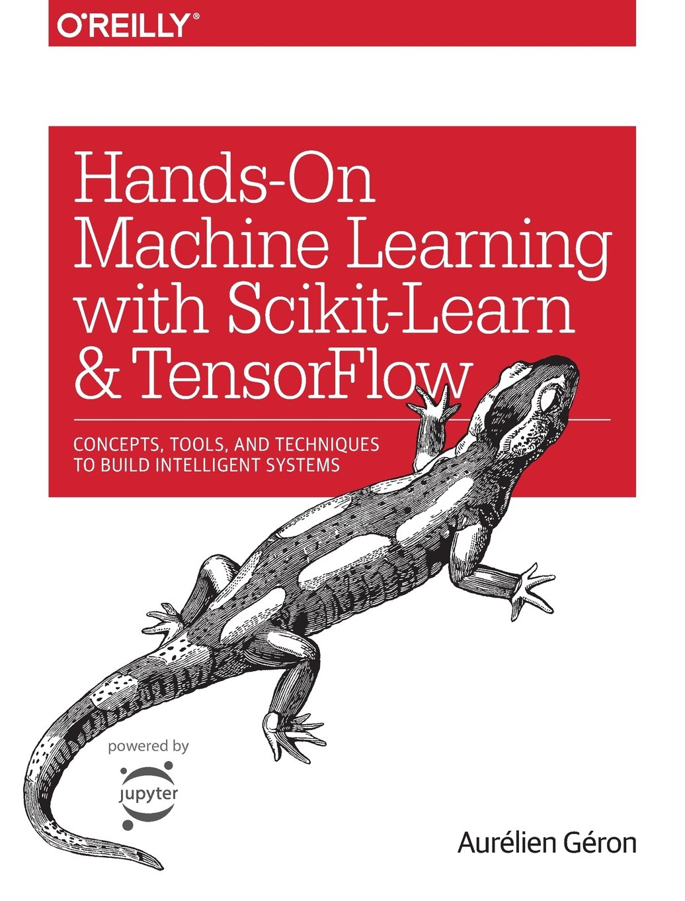

# Hands-on-ML
Estudos do livro: "Hands-on Machine Learning with Scikit-Learn, Keras, and TensorFlow: Concepts, Tools, and Techniques to Build Intelligent Systems". 📚
  

Fiz esse repositório com o intuito de documentar meu aprendizado na área de ciência de dados, especificamente nos estudos de machine learning.

# Estudos

## Capítulo 2: problema de regressão
➡️ [Notebook do projeto]()